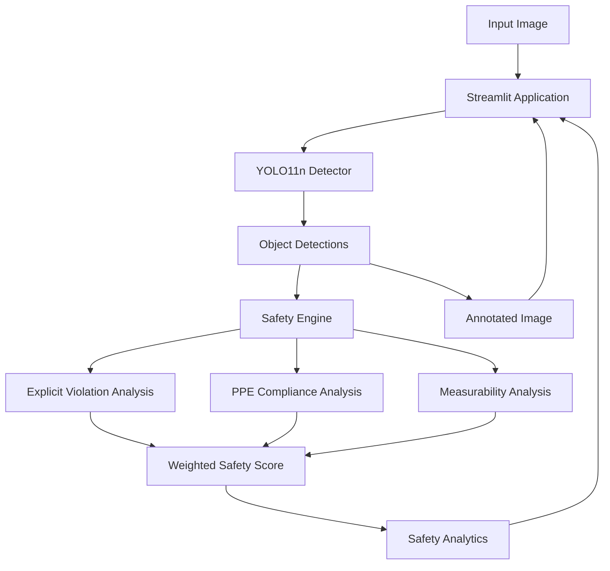

# 🦺 SafeVision AI — Real-Time PPE & Workplace Safety Detection

> An end-to-end Computer Vision system for PPE detection and evidence-based workplace safety analysis using YOLO11n, PyTorch, OpenCV, and Streamlit.

[](https://www.python.org/)
[](https://pytorch.org/)
[](https://ultralytics.com/)
[](https://opencv.org/)
[](https://streamlit.io/)
[](https://github.com/)

**GitHub Repository:**
https://github.com/AbdelrhmanAkl/SafeVision-AI

**Live Demo:**
https://safevision-ai-kk3mxvowvhznzsdgdmzccl.streamlit.app/

---

## 📌 Project Overview

**SafeVision AI** is an AI-powered Computer Vision application for detecting Personal Protective Equipment (PPE) from images and performing **detection-level workplace safety analysis**.

The system combines **YOLO11n object detection** with an explicit safety-rule engine to distinguish between:

* Observed PPE
* Explicitly detected PPE violations
* Requirements for which there is insufficient visual evidence

A key design principle is that **missing detections are not automatically treated as violations**. Explicit negative classes such as `no_helmet`, `no_gloves`, `no_goggle`, and `no_boots` provide direct visual evidence of violations.

This project demonstrates an end-to-end AI engineering workflow spanning:

**model training → inference → business logic → evaluation → application development → cloud deployment**

---

## 🚀 Key Capabilities

* YOLO11n-based PPE object detection
* Image-based inference
* Confidence and bounding-box extraction
* Annotated image visualization
* Explicit PPE violation detection
* Detection-level PPE analytics
* Evidence-based safety analysis
* Weighted measurable safety score
* Insufficient-evidence handling
* Modular inference architecture
* Reusable detector wrapper
* Externalized safety-rule configuration
* Batch test-set evaluation
* Structured evaluation outputs
* Streamlit application
* Streamlit Community Cloud deployment
* Version-pinned dependencies

---

## 🌐 Live Demo

The current application is deployed using **Streamlit Community Cloud**.

**Live Application:**
https://safevision-ai-kk3mxvowvhznzsdgdmzccl.streamlit.app/

The application provides an interactive workflow for uploading an image, running YOLO11n inference, and analyzing the detected PPE evidence through the safety engine.

> **Important:** The current application performs **image-based inference**. Persistent video tracking, worker-level compliance, and person-to-PPE association are not implemented.

---

## 🎯 Problem Statement

Computer Vision can assist workplace safety analysis by detecting PPE-related visual evidence.

However, object detection alone does not necessarily provide a meaningful safety interpretation.

For example:

* Detecting `helmet` provides evidence that a helmet was observed.
* Detecting `no_helmet` provides explicit evidence of a helmet violation.
* Detecting neither does **not** prove that a helmet is absent.

SafeVision AI addresses this distinction by separating:

```text
Object Detection
        ↓
Safety Interpretation
        ↓
Evidence-Based Analytics
```

This prevents the system from incorrectly treating unseen PPE as confirmed non-compliance.

---

## 🧠 Solution Overview

The system processes an uploaded image through a modular inference and safety-analysis pipeline:

```text
Input Image
    │
    ▼
Streamlit Application
    │
    ▼
YOLO11n Detector
    │
    ▼
Object Detections
    │
    ├── PPE Classes
    ├── Explicit Negative Classes
    └── Confidence Scores
    │
    ▼
Safety Engine
    │
    ├── Violation Analysis
    ├── PPE Compliance
    └── Measurability Analysis
    │
    ▼
Weighted Safety Score
    │
    ▼
Safety Analytics
    │
    └── Annotated Image → Streamlit UI
```

---

## 🏗️ System Architecture



The architecture intentionally separates **model inference** from **safety business logic**, allowing each responsibility to remain modular and easier to maintain.

---

## 🔎 Detection Classes

The model operates on **11 classes**:

| Class       | Description                |
| ----------- | -------------------------- |
| `Person`    | Detected person            |
| `helmet`    | Detected helmet            |
| `no_helmet` | Explicit helmet violation  |
| `vest`      | Detected safety vest       |
| `gloves`    | Detected gloves            |
| `no_gloves` | Explicit gloves violation  |
| `boots`     | Detected boots             |
| `no_boots`  | Explicit boots violation   |
| `goggles`   | Detected goggles           |
| `no_goggle` | Explicit goggles violation |
| `none`      | Dataset-defined class      |

> **Dataset limitation:** There is no `no_vest` class.

---

## 🛡️ Safety Analytics

SafeVision uses five PPE requirements with a total weighting of **100**:

| Requirement | Positive Class | Explicit Violation |  Weight |
| ----------- | -------------- | ------------------ | ------: |
| Helmet      | `helmet`       | `no_helmet`        |      25 |
| Goggles     | `goggles`      | `no_goggle`        |      15 |
| Gloves      | `gloves`       | `no_gloves`        |      20 |
| Boots       | `boots`        | `no_boots`         |      20 |
| Vest        | `vest`         | None               |      20 |
| **Total**   |                |                    | **100** |

### Safety Interpretation

The safety engine follows these rules:

1. Positive PPE detections represent **observed PPE**.
2. Explicit negative classes represent **confirmed violations**.
3. Missing PPE detections are **not automatically treated as violations**.
4. If neither positive nor explicit negative evidence exists, the requirement is **not measurable**.
5. The safety score is calculated only from measurable requirements.
6. If no requirement is measurable:

   * `Safety Score = None`
   * `score_status = insufficient_evidence`

This is **detection-level analytical safety scoring**, not certified industrial safety compliance.

---

## 📐 Safety Scoring Methodology

For a measurable PPE requirement with positive and explicit negative detections:

```text
Compliance =
positive / (positive + explicit_negative) × 100
```

The final score is a weighted average over measurable requirements:

```text
Safety Score =
Σ(measurable compliance × requirement weight)
/
Σ(measurable requirement weights)
```

If no requirement provides measurable evidence:

```text
Safety Score = None
score_status = insufficient_evidence
```

### Why Measurability Matters

The system deliberately avoids making an unsafe conclusion solely because an object was not detected.

For example:

```text
No helmet detected
        ≠
Confirmed no helmet
```

A confirmed violation requires the corresponding explicit negative class, such as:

```text
no_helmet
```

---

## 📊 Dataset

### Ultralytics Construction-PPE Dataset

| Property          |    Value |
| ----------------- | -------: |
| Total Images      |    1,416 |
| Training Images   |    1,132 |
| Validation Images |      143 |
| Test Images       |      141 |
| Classes           |       11 |
| License           | AGPL-3.0 |

### Dataset Classes

```text
Person
helmet
no_helmet
vest
gloves
no_gloves
boots
no_boots
goggles
no_goggle
none
```

The dataset should not be interpreted as representative of every industrial environment, camera setup, PPE type, or workplace condition.

---

## 🤖 Model & Training Configuration

### Model

**YOLO11n**

### Framework

**Ultralytics**

### Training Environment

| Component   | Configuration   |
| ----------- | --------------- |
| Platform    | Google Colab    |
| GPU         | NVIDIA Tesla T4 |
| Python      | 3.13.15         |
| PyTorch     | 2.11.0+cu128    |
| Ultralytics | 8.3.203         |

### Production Environment

| Component   | Configuration             |
| ----------- | ------------------------- |
| Python      | 3.12                      |
| Application | Streamlit                 |
| Deployment  | Streamlit Community Cloud |

---

## 📈 Verified Evaluation Results

The model was evaluated using YOLO inference across **all 141 test images**.

### Inference Configuration

| Parameter            | Value |
| -------------------- | ----: |
| Images Evaluated     |   141 |
| Confidence Threshold |  0.25 |
| IoU Threshold        |  0.45 |
| Image Size           |   640 |

### Batch Safety Analysis

| Metric                           |  Result |
| -------------------------------- | ------: |
| Images Analyzed                  |     141 |
| Images with PPE Detections       |     141 |
| PPE Detection Image Rate         | 100.00% |
| Images with Confirmed Violations |      22 |
| Violation Image Rate             |  15.60% |
| Insufficient-Evidence Images     |       4 |
| Insufficient-Evidence Rate       |   2.84% |
| Average Measurable Safety Score  |  84.43% |

> These figures represent the verified analysis of the 141-image test set. They are not a universal accuracy or industrial safety guarantee.

---

## ⚠️ Explicit Violation Analysis

| Violation | Images with Violation | Image Frequency | Violation Detections |
| --------- | --------------------: | --------------: | -------------------: |
| Helmet    |                    28 |          19.86% |                   28 |
| Gloves    |                    16 |          11.35% |                   16 |
| Goggles   |                     9 |           6.38% |                    9 |
| Boots     |                     0 |           0.00% |                    0 |

### Important Metric Distinction

Two different quantities are reported:

* **22** = unique test images containing violations
* **53** = total violation detections across violation categories

Therefore:

> **53 is not the number of violation images.**

---

## 📦 Verified Detected Class Distribution

| Class       | Detections |
| ----------- | ---------: |
| `Person`    |        225 |
| `boots`     |        199 |
| `helmet`    |        185 |
| `vest`      |        179 |
| `gloves`    |        138 |
| `none`      |         64 |
| `goggles`   |         45 |
| `no_helmet` |         28 |
| `no_gloves` |         16 |
| `no_goggle` |          9 |

These are the verified detected-class counts from the test evaluation.

---

## 🖼️ Single-Image Inference Example

### Test Image

```text
image1.jpeg
```

### Observed Detections

| Detection | Confidence |
| --------- | ---------: |
| `vest`    |      0.887 |
| `helmet`  |      0.864 |
| `Person`  |      0.801 |

### Safety Analysis

```text
Safety Score: 100.00%
Score Status: measurable
Violations: 0
```

### PPE Compliance

| Requirement |  Result |
| ----------- | ------: |
| Helmet      | 100.00% |
| Goggles     |     N/A |
| Gloves      |     N/A |
| Boots       |     N/A |
| Vest        |     N/A |

> `N/A` means there is insufficient evidence to measure that specific requirement. It does **not** represent a violation.

---

## ⚙️ Current Application Capabilities

The current Streamlit application supports:

* Image upload
* YOLO11n image inference
* Object detection
* Confidence extraction
* Bounding-box visualization
* Annotated image generation
* Explicit PPE violation detection
* Detection-level PPE analytics
* Evidence-based safety analysis
* Weighted measurable safety score
* Insufficient-evidence handling
* Streamlit deployment

### Current Scope

The application is explicitly **image-based**.

The following capabilities are **not currently implemented**:

* Persistent video tracking
* Multi-object tracking
* Person-to-PPE association
* Worker-level compliance
* RTSP/IP camera processing
* Automated alerts
* Temporal violation persistence

These are listed only as future improvements below.

---

## 🏭 Production-Oriented Project Architecture

SafeVision is structured to separate application, inference, configuration, evaluation, and safety logic.

```text
SafeVision-AI/
├── assets/
├── config/
│   └── safety_rules_config.json
├── evaluation/
│   └── batch_safety_results.json
├── models/
│   └── best.pt
├── notebooks/
│   └── SafeVision_AI_Training_Evaluation.ipynb
├── src/
│   ├── __init__.py
│   ├── config.py
│   ├── detector.py
│   ├── safety_engine.py
│   └── utils.py
├── app.py
├── README.md
├── .gitignore
└── requirements.txt
```

---

## 🧩 Core Modules

### `src/config.py`

Centralized project paths and inference configuration.

### `src/detector.py`

Production YOLO inference wrapper responsible for:

* Model loading
* Inference
* Detection extraction
* Confidence values
* Bounding boxes
* Annotated image generation
* Integration with safety analysis

### `src/safety_engine.py`

Responsible for:

* PPE rules
* Explicit violation detection
* Compliance calculation
* Measurability analysis
* Weighted safety scoring

### `src/utils.py`

Display and inference helper utilities.

### `app.py`

Streamlit application interface.

### `config/safety_rules_config.json`

Externalized safety-rule configuration.

### `evaluation/batch_safety_results.json`

Stored batch evaluation results.

### `models/best.pt`

Trained YOLO11n model weights.

---

## 🔄 Application Workflow

```text
1. Upload Image
       ↓
2. Load YOLO11n Model
       ↓
3. Run YOLO Inference
       ↓
4. Extract Objects & Confidence Scores
       ↓
5. Apply Safety Rules
       ↓
6. Identify Explicit Violations
       ↓
7. Calculate Measurable PPE Compliance
       ↓
8. Calculate Weighted Safety Score
       ↓
9. Display Annotated Image & Safety Analytics
```

---

## 🧱 Engineering Design

SafeVision demonstrates several practical AI engineering principles beyond model inference.

### Separation of Concerns

Object detection and safety interpretation are implemented as separate responsibilities.

### Modular Architecture

The detector, safety engine, configuration, utilities, evaluation, and application interface are separated into dedicated components.

### Reusable Inference Wrapper

Model inference is encapsulated in a reusable detector module rather than being tightly coupled to the Streamlit UI.

### Externalized Configuration

Safety requirements and their weights are maintained through an external configuration file.

### Evidence-Based Business Logic

The system distinguishes between:

* Positive PPE evidence
* Explicit negative evidence
* Missing evidence

### Conservative Uncertainty Handling

When evidence is insufficient, the system can return:

```text
insufficient_evidence
```

instead of forcing an unsafe/safe interpretation.

### Structured Evaluation

Batch evaluation results are stored in a structured JSON output.

### Cloud Deployment

The application has been deployed through Streamlit Community Cloud.

---

## 🛠️ Tech Stack

| Technology  | Role                                 |
| ----------- | ------------------------------------ |
| Python      | Core development                     |
| PyTorch     | Deep learning framework              |
| Ultralytics | YOLO implementation                  |
| YOLO11n     | Object detection                     |
| OpenCV      | Computer vision and image processing |
| NumPy       | Numerical operations                 |
| Pandas      | Data processing                      |
| Matplotlib  | Analysis and visualization           |
| Streamlit   | Application and deployment           |
| Git         | Version control                      |
| GitHub      | Repository hosting                   |

---

## 💻 Installation

### 1. Clone the Repository

```bash
git clone https://github.com/AbdelrhmanAkl/SafeVision-AI.git
```

### 2. Enter the Project Directory

```bash
cd SafeVision-AI
```

### 3. Create a Virtual Environment

```bash
python -m venv .venv
```

### 4. Activate the Environment

**Windows:**

```bash
.venv\Scripts\activate
```

### 5. Install Dependencies

```bash
pip install -r requirements.txt
```

### 6. Run the Application

```bash
streamlit run app.py
```

---

## ▶️ Usage

After launching the application:

1. Open the Streamlit interface.
2. Upload a workplace image.
3. SafeVision runs YOLO11n inference.
4. Detected objects, confidence values, and bounding boxes are extracted.
5. The safety engine evaluates the available PPE evidence.
6. Explicit violation classes are identified.
7. Measurable PPE compliance is calculated.
8. A weighted safety score is generated when sufficient evidence exists.
9. The annotated image and safety analytics are displayed.

---

## ⚠️ Limitations

SafeVision AI is intentionally transparent about the boundaries of its current implementation.

### 1. Image-Based Inference

The current system performs image-level inference rather than persistent video tracking.

### 2. No PPE-to-Worker Association

The system does not associate individual PPE detections with specific workers.

### 3. No Worker-Level Compliance

A detected PPE item cannot be assumed to belong to a specific person.

For example, detecting a helmet in an image does not establish that the helmet belongs to a particular detected worker.

### 4. Conservative Missing-Detection Handling

Missing PPE detections are not automatically considered violations.

A requirement is measurable only when the available visual evidence supports the analysis.

### 5. No `no_vest` Class

The dataset contains `vest` but does not contain an explicit `no_vest` class.

Therefore, the system cannot confirm a missing vest through a dedicated negative class in the same way it can for helmets, gloves, goggles, and boots.

### 6. Dataset Generalization

Performance may vary across:

* Camera angles
* Lighting conditions
* PPE types
* Image quality
* Workplace environments
* Industrial settings not represented in the dataset

### 7. Safety Score Interpretation

The safety score is an **analytical indicator based on detected visual evidence**.

It is not a certified industrial safety measurement.

### 8. Detection Errors

False positives and false negatives can occur.

### 9. Industrial Certification

The current application should not be represented as a certified workplace compliance or industrial surveillance system.

It does not provide medical, legal, or industrial certification.

---

## 🔮 Future Improvements

The following are potential future engineering extensions and are **not currently implemented**:

* Real-time video stream processing
* Multi-object tracking
* Person-to-PPE association
* Worker-level compliance tracking
* Temporal violation persistence
* Automated alert generation
* Event logging
* Video analytics
* RTSP/IP camera support
* Dashboard analytics
* Model optimization
* ONNX/TensorRT deployment
* Edge deployment
* Confidence calibration
* More diverse industrial datasets

These improvements would extend the current image-level detection architecture toward continuous workplace safety analytics.

---

## 📜 Dataset & License Note

SafeVision AI uses the **Ultralytics Construction-PPE Dataset** with:

* **1,416 images**
* **11 classes**
* **AGPL-3.0 license**

The dataset should not be assumed to represent every industrial environment or workplace safety scenario.

Users should independently review the applicable dataset licensing terms and requirements before using the dataset or resulting models in other contexts.

---

## 🔗 Repository & Demo

**GitHub Repository:**
https://github.com/AbdelrhmanAkl/SafeVision-AI

**Live Streamlit Demo:**
https://safevision-ai-kk3mxvowvhznzsdgdmzccl.streamlit.app/

---

## 👨‍💻 Author

**Eng.Abdelrhman Akl**

Computer Vision & AI/ML Engineering Portfolio Project

---

## 📌 Final Project Summary

SafeVision AI demonstrates an end-to-end approach to building a Computer Vision application that extends beyond model training and inference.

The complete workflow combines:

```text
Dataset
   ↓
YOLO11n Training
   ↓
Object Detection
   ↓
Production Inference Wrapper
   ↓
Safety Rule Engine
   ↓
Evidence-Based Analytics
   ↓
Batch Evaluation
   ↓
Streamlit Application
   ↓
Cloud Deployment
```

The core engineering principle is **evidence-based safety analysis**.

Explicit negative detections can provide evidence of PPE violations, while missing observations are handled conservatively rather than automatically being interpreted as unsafe conditions.

This architecture provides a clear foundation for future extensions such as video tracking, person-to-PPE association, worker-level analytics, temporal violation analysis, alerting, model optimization, and edge deployment.
